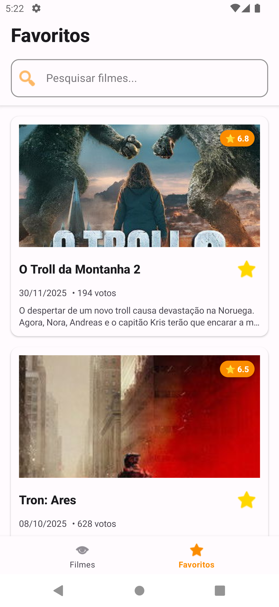
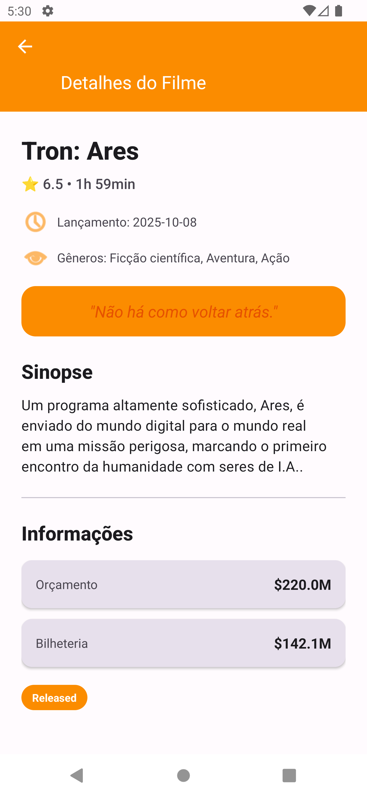

# My Challenge - Movies App

Aplicativo Android desenvolvido para exibir filmes populares, pesquisar filmes e gerenciar favoritos utilizando a API do TMDb (The Movie Database).

## 📸 Screenshots / Demo

<!-- Adicione aqui screenshots ou GIFs das telas do aplicativo -->
<!-- 
Exemplo:






-->

**Espaço reservado para screenshots/GIFs das telas:** 
<div> 


</div>

## 📋 Requisitos do Desafio - Checklist

### ✅ Funcionalidades Obrigatórias

- ✅ **Listagem de Filmes Populares**: 
  - Lista paginada de filmes populares obtidos da API do TMDb
  - Implementada com **Paging 3** para paginação eficiente
  - Exibe título, imagem do pôster e avaliação média
  - Scroll infinito com carregamento automático

- ✅ **Pesquisa de Filmes**: 
  - Campo de busca para pesquisar filmes específicos
  - Busca em tempo real na API com debounce de 500ms
  - Resultados paginados exibidos em tempo real
  - Volta para lista popular quando busca é limpa

- ✅ **Favoritar Filmes**: 
  - Usuário pode marcar/desmarcar filmes como favoritos
  - Filmes favoritos armazenados localmente no dispositivo usando Room
  - Tela separada para exibir apenas os filmes favoritos
  - Busca integrada na tela de favoritos
  - Sincronização automática entre telas via Flow

- ✅ **Tratamento de Erros**: 
  - Lida com erros de rede (UnknownHostException, SocketTimeoutException)
  - Exibe mensagens amigáveis ao usuário em português
  - Telas específicas para diferentes tipos de erro:
    - Erro de conexão com internet
    - Erro genérico com retry
  - Tratamento específico para códigos HTTP (401, 404, 429, 500)

- ✅ **Testes Unitários**: 
  - Testes para camadas de lógica (ViewModels, UseCases)
  - Testes para integração com API (Repository)
  - Cobertura de código com JaCoCo
  - Relatórios de cobertura gerados automaticamente

### ✅ Requisitos Técnicos

- ✅ **Arquitetura**: 
  - Clean Architecture + MVVM implementada
  - Decisões arquiteturais documentadas (ver seção Arquitetura)

- ✅ **Comunicação com API**: 
  - Retrofit + OkHttp para comunicação HTTP
  - Suporte à paginação implementado com **Paging 3**
  - Interceptors para autenticação automática

- ✅ **Persistência Local**: 
  - Room Database para armazenar filmes favoritos
  - Flow para observação reativa de dados
  - Queries type-safe em tempo de compilação

- ✅ **Gerenciamento de Estado**: 
  - StateFlow para gerenciamento reativo de estado
  - Coroutines para programação assíncrona
  - Single Source of Truth para favoritos

- ✅ **Interface do Usuário**: 
  - Interface responsiva seguindo Material Design 3
  - Componentes Material Design (Cards, TextFields, Buttons)
  - Layout adaptável a diferentes tamanhos de tela

- ✅ **Boas Práticas**: 
  - Código limpo, legível e bem estruturado
  - Injeção de dependência com Hilt
  - Código documentado com KDoc
  - Análise estática com detekt e ktlint

## 📱 Funcionalidades Adicionais Implementadas

Além dos requisitos obrigatórios, foram implementadas funcionalidades extras:

- ✅ **Detalhes do Filme**: Tela completa com informações detalhadas (sinopse, gêneros, orçamento, bilheteria, etc.)
- ✅ **Splash Screen**: Tela inicial profissional com logo do aplicativo
- ✅ **Shimmer Effect**: Efeito de loading durante carregamento de imagens
- ✅ **Estados de Loading**: Gerenciamento automático de estados via Paging 3
- ✅ **CI/CD**: GitHub Actions configurado para automação
- ✅ **Code Quality**: ktlint e detekt configurados

## 🚀 Como Executar

### Pré-requisitos

- Android Studio Hedgehog | 2023.1.1 ou superior
- JDK 17 ou superior
- Android SDK com API Level 27+ (Android 8.1+)
- Conexão com a internet para acessar a API do TMDb

### Instalação

1. Clone o repositório:
```bash
git clone https://github.com/seu-usuario/MyChallenge.git
cd MyChallenge
```

2. Abra o projeto no Android Studio

3. Sincronize o Gradle (o Android Studio fará isso automaticamente)

4. Execute o aplicativo em um dispositivo ou emulador Android

### Configuração da API

O aplicativo utiliza um Bearer Token para autenticação com a API do TMDb. O token deve ser configurado no arquivo `local.properties` (que não é commitado no repositório):

```properties
TMDB_BEARER_TOKEN=seu_token_aqui
```

O token é carregado automaticamente pelo BuildConfig durante o build. Se o token não estiver configurado, o aplicativo lançará uma exceção informativa ao iniciar.

**Nota**: O arquivo `local.properties` já está no `.gitignore` para garantir que tokens não sejam commitados acidentalmente.

## 🏗️ Arquitetura

### Decisão Arquitetural

O projeto utiliza **Clean Architecture** combinada com **MVVM (Model-View-ViewModel)** para garantir separação de responsabilidades, testabilidade e escalabilidade.

**Justificativa da Escolha:**
- **Separação de Responsabilidades**: Cada camada tem uma responsabilidade única e bem definida
- **Testabilidade**: Facilita a criação de testes unitários isolados, permitindo mockar dependências facilmente
- **Manutenibilidade**: Código mais organizado e fácil de entender, facilitando manutenção futura
- **Escalabilidade**: Facilita adicionar novas funcionalidades sem impactar código existente
- **Independência de Frameworks**: A camada de domínio não depende de bibliotecas Android, facilitando testes

> 📚 Para uma explicação detalhada das decisões arquiteturais, alternativas consideradas e trade-offs, consulte **[DOCUMENTACAO_TECNICA.md](./DOCUMENTACAO_TECNICA.md)**.

### Camadas da Arquitetura

```
┌─────────────────────────────────────┐
│      Presentation Layer             │
│  (Activities, Fragments, ViewModels)│
└─────────────────────────────────────┘
                  ↓
┌─────────────────────────────────────┐
│        Domain Layer                  │
│  (UseCases, Models, Repository)     │
└─────────────────────────────────────┘
                  ↓
┌─────────────────────────────────────┐
│         Data Layer                   │
│  (Repository, API, Local DB)       │
└─────────────────────────────────────┘
```

#### **Presentation Layer**
- **Activities/Fragments**: Componentes de UI responsáveis pela interação com o usuário
- **ViewModels**: Gerenciam o estado da UI e a lógica de apresentação usando StateFlow
- **ViewObjects**: Modelos otimizados para exibição na UI
- **Mappers**: Convertem modelos de Domain para ViewObjects

#### **Domain Layer**
- **UseCases**: Contêm a lógica de negócio específica de cada funcionalidade
- **Models**: Entidades de domínio independentes de frameworks
- **Repository Interface**: Define contratos para acesso aos dados

#### **Data Layer**
- **Repository Implementation**: Implementa a lógica de acesso aos dados
- **API Service**: Comunicação com a API do TMDb via Retrofit
- **Local Database**: Persistência local usando Room
- **DTOs**: Data Transfer Objects para comunicação com a API
- **Entities**: Entidades do Room para persistência local

### Decisões Arquiteturais

1. **Clean Architecture**: Escolhida para garantir independência entre camadas, facilitando testes e manutenção
2. **MVVM**: Padrão complementar que facilita a separação entre UI e lógica de negócio
3. **UseCases**: Cada funcionalidade tem seu UseCase próprio, garantindo Single Responsibility Principle
4. **StateFlow**: Utilizado para gerenciamento reativo de estado, permitindo observação de mudanças
5. **Single Source of Truth**: Os favoritos são a única fonte de verdade, atualizados via Flow reativo

## 🛠️ Stack Tecnológica

### Core
- **Kotlin**: Linguagem de programação
- **Android SDK**: API Level 27+ (Android 8.1+)

### Arquitetura & DI
- **Hilt**: Injeção de dependência
- **Clean Architecture**: Separação de camadas
- **MVVM**: Padrão de arquitetura

### UI
- **Material Design 3**: Design system moderno
- **ViewBinding**: Binding de views type-safe
- **Navigation Component**: Navegação entre telas
- **Coil**: Carregamento de imagens
- **Shimmer**: Efeito de loading nas imagens

### Networking
- **Retrofit**: Cliente HTTP type-safe para comunicação com API do TMDb
- **OkHttp**: Cliente HTTP base com interceptors customizados
- **Moshi**: Serialização/desserialização JSON otimizada para Kotlin
- **HttpLoggingInterceptor**: Logging de requisições HTTP para debug
- **AuthInterceptor**: Interceptor customizado para adicionar Bearer Token automaticamente
- **Paginação**: Implementada com **Paging 3** para gerenciamento eficiente de dados paginados

### Persistência
- **Room**: Banco de dados local para armazenamento de filmes favoritos
- **Flow**: Observação reativa de dados com atualizações automáticas
- **DAO (Data Access Objects)**: Queries type-safe em tempo de compilação
- **Type Converters**: Conversão automática de tipos complexos (List<String>)

### Assíncrono
- **Coroutines**: Programação assíncrona
- **Flow**: Streams de dados reativos

### Testes
- **JUnit**: Framework de testes unitários
- **MockK**: Mocking para Kotlin
- **Turbine**: Testes para Flow
- **Coroutines Test**: Testes para corrotinas
- **JaCoCo**: Cobertura de código

### Code Quality
- **ktlint**: Linter para Kotlin
- **detekt**: Análise estática de código

## 📦 Estrutura do Projeto

```
app/src/main/java/com/onboarding/mychallenge/
├── data/                          # Data Layer
│   ├── di/                       # Módulos de injeção de dependência
│   ├── local/                    # Persistência local (Room)
│   │   ├── dao/                  # Data Access Objects
│   │   ├── database/             # Configuração do banco
│   │   ├── entity/               # Entidades do Room
│   │   └── converter/            # Type converters
│   ├── mapper/                   # Mappers DTO → Domain
│   ├── remote/                   # Comunicação com API
│   │   ├── api/                  # Interface Retrofit
│   │   ├── dto/                  # Data Transfer Objects
│   │   └── interceptor/          # Interceptors HTTP
│   └── repository/               # Implementação do Repository
├── domain/                        # Domain Layer
│   ├── model/                    # Modelos de domínio
│   ├── repository/               # Interface do Repository
│   └── usecase/                  # Use Cases
└── presentation/                  # Presentation Layer
    ├── error/                    # Telas de erro
    ├── favorites/                # Tela de favoritos
    ├── mapper/                   # Mappers Domain → ViewObject
    ├── movieDetail/              # Tela de detalhes
    ├── movieList/                # Tela de lista de filmes
    └── splash/                   # Splash Screen
```

## 🧪 Testes

### Requisitos Atendidos

✅ **Testes Unitários**: Implementados para camadas de lógica e integração com API
⏳ **Testes Instrumentados**: Planejados como melhoria futura (ver seção de melhorias)

O projeto inclui testes unitários abrangentes para as principais camadas:

### Executar Testes

```bash
# Todos os testes
./gradlew testDebugUnitTest

# Gerar relatório de cobertura
./gradlew jacocoTestReport

# Verificar cobertura mínima (desabilitado - melhoria futura)
# ./gradlew jacocoTestCoverageVerification
```

### Cobertura de Testes

- ✅ **ViewModels**: Testes para MovieListViewModel, FavoritesViewModel, MovieDetailViewModel
- ✅ **UseCases**: Testes para todos os UseCases (GetPopularMovies, SearchMovies, AddToFavorites, etc.)
- ✅ **Repository**: Testes para MovieRepositoryImpl com casos de erro HTTP, timeout e validações
- ✅ **Mappers**: Validação de conversão de dados (MovieMapper)
- ✅ **Interceptors**: Testes para AuthInterceptor
- ✅ **Adapters**: Testes básicos para ShimmerAdapter
- ✅ **Models**: Testes para propriedades computadas (MovieDetail)

### Relatórios de Cobertura

Os relatórios JaCoCo são gerados em:
- HTML: `app/build/reports/jacoco/jacocoTestReport/html/index.html`
- XML: `app/build/reports/jacoco/jacocoTestReport/jacocoTestReport.xml`

## 📋 Funcionalidades Detalhadas

### Listagem de Filmes Populares
- ✅ **Paginação com Paging 3**: Implementada usando AndroidX Paging 3 library para gerenciamento eficiente de paginação
- ✅ **Scroll Infinito**: Carregamento automático de mais páginas ao chegar no final da lista
- ✅ **Exibição Completa**: Título, pôster, avaliação média (⭐), número de votos e data de lançamento
- ✅ **Shimmer Effect**: Efeito de loading durante carregamento de imagens
- ✅ **Estados de Loading**: Gerenciamento automático de estados (loading, error, empty) via Paging 3
- ✅ **Tratamento de Erros**: Mensagens amigáveis ao usuário em português

### Pesquisa de Filmes
- Campo de busca com debounce de 500ms
- Busca em tempo real na API
- Resultados paginados
- Volta para lista popular quando busca é limpa
- Tratamento de erros específicos (404 para "não encontrado")

### Favoritar Filmes
- Botão de favorito em cada item da lista
- Indicador visual de loading durante operação
- Persistência local usando Room
- Armazenamento de detalhes completos do filme
- Sincronização automática entre telas via Flow

### Tela de Favoritos
- Lista todos os filmes favoritos
- Busca local nos favoritos
- Remoção de favoritos
- Mensagem quando não há favoritos
- Navegação para detalhes do filme

### Tratamento de Erros
- **Erro de Conexão**: Tela específica para erros de internet com opção de retry
- **Erro Genérico**: Tela de erro genérica com retry limitado
- Mensagens amigáveis ao usuário em português
- Tratamento específico para diferentes códigos HTTP (401, 404, 429, 500)
- Tratamento de UnknownHostException e SocketTimeoutException

## 📝 Decisões Técnicas e Justificativas

> 📚 **Documentação Técnica Completa**: Para uma explicação detalhada de todas as decisões técnicas, alternativas consideradas, trade-offs e referências, consulte o arquivo **[DOCUMENTACAO_TECNICA.md](./DOCUMENTACAO_TECNICA.md)**.

### Requisitos Técnicos Atendidos

#### ✅ Arquitetura
- **Clean Architecture + MVVM**: Arquitetura moderna e escalável implementada
- **Separação de Camadas**: Presentation, Domain e Data layers bem definidas
- **Justificativas**: Documentadas na seção de Arquitetura acima e em detalhes na [DOCUMENTACAO_TECNICA.md](./DOCUMENTACAO_TECNICA.md)

#### ✅ Comunicação com API
- **Retrofit + OkHttp**: Cliente HTTP type-safe e performático
- **Paginação**: ✅ **Implementada com Paging 3** - Biblioteca oficial do Android para paginação eficiente
- **Interceptors**: AuthInterceptor para autenticação automática
- **Tratamento de Erros**: Tratamento específico para diferentes códigos HTTP

#### ✅ Persistência Local
- **Room Database**: Solução oficial do Google para persistência local
- **Flow Reativo**: Atualizações automáticas quando dados mudam
- **Type Safety**: Queries type-safe em tempo de compilação

#### ✅ Gerenciamento de Estado
- **StateFlow**: Abordagem moderna e reativa para gerenciamento de estado
- **Coroutines**: Programação assíncrona nativa do Kotlin
- **Single Source of Truth**: Favoritos são a única fonte de verdade

#### ✅ Interface do Usuário
- **Material Design 3**: Segue diretrizes oficiais do Material Design
- **Responsiva**: Layout adaptável a diferentes tamanhos de tela
- **Componentes Modernos**: RecyclerView, ViewBinding, Navigation Component

#### ✅ Boas Práticas
- **Código Limpo**: Código legível, bem estruturado e documentado
- **Injeção de Dependência**: ✅ **Hilt** implementado para DI
- **Documentação**: Código documentado com KDoc quando necessário
- **Code Quality**: ktlint e detekt configurados para garantir qualidade

A documentação técnica inclui:
- ✅ Explicação detalhada de cada decisão arquitetural
- ✅ Alternativas consideradas e por que foram descartadas
- ✅ Trade-offs e justificativas técnicas
- ✅ Links para documentação oficial e artigos de referência
- ✅ Exemplos de código e configurações
- ✅ Melhorias futuras planejadas

### Resumo das Principais Decisões

### Por que Clean Architecture + MVVM?
- **Separação de Responsabilidades**: Cada camada tem uma responsabilidade clara
- **Testabilidade**: Facilita a criação de testes unitários isolados
- **Manutenibilidade**: Código mais fácil de entender e modificar
- **Escalabilidade**: Facilita adicionar novas funcionalidades

### Por que StateFlow ao invés de LiveData?
- **Coroutines First**: StateFlow é nativo do Kotlin e funciona melhor com Coroutines
- **Type Safety**: Melhor suporte a tipos genéricos
- **Operadores**: Mais operadores funcionais disponíveis
- **Cold Flow**: Permite controle mais fino sobre quando o Flow é coletado

### Por que UseCases?
- **Single Responsibility**: Cada UseCase tem uma única responsabilidade
- **Reutilização**: Lógica de negócio pode ser reutilizada em diferentes ViewModels
- **Testabilidade**: Mais fácil testar lógica de negócio isoladamente
- **Clareza**: Código mais legível e fácil de entender

### Por que Room ao invés de outras soluções?
- **Oficial Android**: Solução oficial do Google para persistência local
- **Type Safety**: Queries type-safe em tempo de compilação
- **Reativo**: Suporte nativo a Flow para observação reativa
- **Performance**: Otimizado para Android

### Por que Debounce na Pesquisa?
- **Performance**: Reduz número de requisições à API
- **UX**: Melhora experiência do usuário evitando buscas desnecessárias
- **Economia**: Reduz uso de dados e recursos do servidor

### Por que Hilt para DI?
- **Oficial Android**: Solução oficial do Google baseada em Dagger
- **Simplicidade**: Menos boilerplate que Dagger
- **Integração**: Integração nativa com Android e ViewModels
- **Testabilidade**: Facilita criação de testes com mocks

## 🔄 CI/CD

O projeto utiliza GitHub Actions para automação de CI/CD:

### Workflow Principal

O workflow `.github/workflows/ci.yml` executa:
1. ✅ Checkout do código
2. ✅ Setup do JDK 17
3. ✅ Cache de dependências Gradle
4. ✅ Verificação de código (ktlint)
5. ✅ Análise estática (detekt)
6. ✅ Execução de testes unitários
7. ✅ Geração de relatório JaCoCo
8. ✅ Upload do relatório de cobertura
9. ✅ Build do APK

### Status

- ✅ CI/CD configurado e funcionando
- ✅ Relatórios de cobertura gerados automaticamente
- ⏳ Verificação de cobertura mínima desabilitada (melhoria futura)

## 🎨 Design

O aplicativo segue as diretrizes do **Material Design 3** com:
- Paleta de cores personalizada baseada em `#FB8C00`
- Componentes Material Design (Cards, TextFields, Buttons)
- Suporte a tema claro e escuro
- Animações suaves e transições
- Layout responsivo

## 🔒 Segurança

- Bearer Token para autenticação com API
- Validação de dados antes de processamento
- Tratamento seguro de erros sem expor informações sensíveis
- Validação de entrada do usuário

## 💪 Esforço Aplicado

Este projeto foi desenvolvido com foco em **qualidade, arquitetura sólida e boas práticas**. Abaixo estão os principais esforços aplicados:

### Arquitetura e Design
- ✅ Implementação completa de Clean Architecture com 3 camadas bem definidas
- ✅ Padrão MVVM com ViewModels e StateFlow para gerenciamento reativo de estado
- ✅ UseCases para separação de lógica de negócio
- ✅ Repository Pattern para abstração de fonte de dados
- ✅ Mappers para conversão entre camadas (DTO → Domain → ViewObject)

### Funcionalidades Implementadas
- ✅ Listagem paginada de filmes populares com **Paging 3**
- ✅ Pesquisa em tempo real com debounce (500ms)
- ✅ Sistema completo de favoritos com persistência local
- ✅ Tela dedicada de favoritos com busca integrada
- ✅ Tela de detalhes completa do filme
- ✅ Tratamento robusto de erros com telas específicas
- ✅ Splash screen profissional

### Qualidade de Código
- ✅ Testes unitários abrangentes para ViewModels, UseCases, Repository e Mappers
- ✅ Cobertura de código com JaCoCo (relatórios gerados automaticamente)
- ✅ Análise estática com detekt
- ✅ Formatação automática com ktlint
- ✅ CI/CD configurado com GitHub Actions

### Segurança
- ✅ Token da API armazenado de forma segura em `local.properties`
- ✅ Validação de dados antes de processamento
- ✅ Tratamento seguro de erros sem expor informações sensíveis

### Performance
- ✅ Paginação eficiente com Paging 3 (cache automático)
- ✅ Debounce na pesquisa para reduzir requisições
- ✅ Cache de imagens com Coil
- ✅ Carregamento assíncrono com Coroutines

### UX/UI
- ✅ Material Design 3 implementado
- ✅ Suporte a tema claro e escuro
- ✅ Shimmer effect durante carregamento
- ✅ Estados de loading, error e empty bem definidos
- ✅ Animações suaves e transições

### Documentação
- ✅ README completo e detalhado
- ✅ Documentação técnica completa (DOCUMENTACAO_TECNICA.md)
- ✅ Código documentado com KDoc
- ✅ Comentários explicativos em pontos complexos

### Migrações e Melhorias
- ✅ Migração de paginação manual para **Paging 3**
- ✅ Correção de lógica de `canLoadMore`
- ✅ Remoção de blocos de código vazios
- ✅ Melhoria na estrutura de testes

## 📈 Pontos de Melhoria Futura

Como especialista Android, identifiquei as seguintes melhorias que podem ser implementadas para elevar ainda mais a qualidade do projeto:

### 1. Cobertura de Testes ⭐⭐⭐⭐⭐

**Status Atual**: Testes unitários implementados para camadas principais

**Melhorias Sugeridas**:
- **Implementar verificação de cobertura mínima**: Atualmente os relatórios são gerados mas não há verificação de mínimo. Recomenda-se habilitar gradualmente até atingir pelo menos 70% de cobertura
- **Testes de integração**: Adicionar testes que validem a integração entre camadas
- **Testes instrumentados (UI)**: Implementar testes com Espresso para validar fluxos completos do usuário
- **Testes de snapshot**: Considerar usar ferramentas como Shot para testes de UI

**Impacto**: Alto - Melhora confiabilidade e facilita refatoração

### 2. Migração para Jetpack Compose ⭐⭐⭐⭐⭐

**Status Atual**: UI implementada com Views tradicionais (XML + ViewBinding)

**Melhorias Sugeridas**:
- **Migração gradual**: Começar migrando telas simples (Splash, Error) para Compose
- **Compose Navigation**: Substituir Navigation Component por Navigation Compose
- **State Hoisting**: Aproveitar melhor o gerenciamento de estado reativo do Compose
- **Material 3**: Implementar Material Design 3 completo com Compose
- **Preview**: Aproveitar previews do Compose para desenvolvimento mais rápido

**Benefícios**:
- Código mais declarativo e menos boilerplate
- Melhor performance com recomposição inteligente
- Desenvolvimento mais rápido com previews
- Alinhamento com futuro do Android

**Impacto**: Muito Alto - Modernização da stack e melhor DX

### 3. Ferramentas de Performance ⭐⭐⭐⭐

**Melhorias Sugeridas**:
- **Baseline Profiles**: Implementar Baseline Profiles para melhorar startup time
- **App Startup**: Usar App Startup library para inicialização otimizada
- **Memory Profiling**: Integrar LeakCanary para detecção de memory leaks
- **Performance Monitoring**: Integrar Firebase Performance Monitoring ou similar
- **Image Optimization**: Implementar cache de imagens mais agressivo com Coil
- **Database Indexing**: Adicionar índices no Room para queries mais rápidas

**Impacto**: Alto - Melhora experiência do usuário

### 4. Arquitetura e Padrões ⭐⭐⭐⭐

**Melhorias Sugeridas**:
- **Repository Pattern Enhancement**: Implementar cache strategy (Network-First, Cache-First)
- **Error Handling**: Criar sealed classes para tipos de erro mais específicos
- **Loading States**: Implementar estados de loading mais granulares (Initial, Refreshing, LoadingMore)
- **WorkManager**: Implementar sincronização em background para favoritos

**Impacto**: Médio-Alto - Melhora arquitetura e escalabilidade

### 5. Qualidade de Código ⭐⭐⭐⭐

**Melhorias Sugeridas**:
- **Documentação KDoc**: Completar documentação KDoc em todas as classes públicas
- **Code Review**: Implementar CodeRabbit ou similar para code review automatizado
- **Dependency Updates**: Configurar Dependabot para atualizações automáticas
- **Modularização**: Considerar modularização do projeto (feature modules)
- **API Versioning**: Implementar versionamento de API para facilitar evolução

**Impacto**: Médio - Melhora manutenibilidade

### 6. UX/UI ⭐⭐⭐

**Melhorias Sugeridas**:
- **Empty States**: Melhorar estados vazios com ilustrações
- **Error States**: Melhorar telas de erro com ilustrações e ações mais claras
- **Pull to Refresh**: Implementar pull-to-refresh na lista de filmes
- **Swipe Actions**: Implementar swipe para favoritar/desfavoritar
- **Animations**: Adicionar mais animações e transições suaves
- **Accessibility**: Melhorar acessibilidade com content descriptions completos

**Impacto**: Médio - Melhora experiência do usuário

### 7. Funcionalidades Adicionais ⭐⭐⭐

**Melhorias Sugeridas**:
- **Offline Support**: Implementar modo offline completo com cache de dados
- **Sync Strategy**: Implementar sincronização inteligente de favoritos
- **Filters**: Adicionar filtros por gênero, ano, avaliação
- **Sorting**: Implementar ordenação de resultados
- **Share**: Adicionar compartilhamento de filmes
- **Deep Links**: Implementar deep links para navegação direta

**Impacto**: Médio - Adiciona valor ao produto

### 8. DevOps e Infraestrutura ⭐⭐⭐

**Melhorias Sugeridas**:
- **Fastlane**: Implementar Fastlane para automação de builds e releases
- **Firebase App Distribution**: Configurar distribuição de builds de teste
- **Crash Reporting**: Integrar Firebase Crashlytics
- **Analytics**: Implementar analytics para entender uso do app
- **Feature Flags**: Implementar feature flags para releases graduais
- **A/B Testing**: Considerar A/B testing para melhorias de UX

**Impacto**: Médio - Melhora processo de desenvolvimento e release

### 9. Segurança ⭐⭐⭐⭐

**Melhorias Sugeridas**:
- **Secrets Management**: ✅ Tokens movidos para `local.properties` (implementado). Para produção, considerar Android Keystore ou variáveis de ambiente do CI/CD
- **Certificate Pinning**: Implementar certificate pinning para API
- **ProGuard/R8**: Configurar ProGuard/R8 para ofuscação em release
- **Security Headers**: Validar headers de segurança nas requisições
- **Input Validation**: Reforçar validação de inputs do usuário

**Impacto**: Alto - Melhora segurança do aplicativo

### 10. Internacionalização ⭐⭐

**Melhorias Sugeridas**:
- **i18n**: Implementar suporte completo a múltiplos idiomas
- **Localization**: Adicionar strings traduzidas para diferentes idiomas
- **RTL Support**: Implementar suporte a RTL (Right-to-Left)

**Impacto**: Baixo-Médio - Expande alcance do aplicativo

## 📊 Priorização de Melhorias

### Curto Prazo (1-2 semanas)
1. ✅ Aumentar cobertura de testes para 70%+
2. ✅ Implementar LeakCanary
3. ✅ Completar documentação KDoc
4. ✅ Melhorar acessibilidade

### Médio Prazo (1-2 meses)
1. ✅ Migração gradual para Compose
2. ✅ Adicionar Baseline Profiles
3. ✅ Implementar cache strategy

### Longo Prazo (3+ meses)
1. ✅ Modularização do projeto
2. ✅ Implementar modo offline completo
3. ✅ Adicionar analytics e crash reporting
4. ✅ Implementar feature flags

## 📄 Licença

Este projeto foi desenvolvido exclusivamente para fins de avaliação técnica.

---

**Nota**: Este aplicativo utiliza a API do TMDb. Certifique-se de respeitar os termos de uso da API ao utilizar este código.
